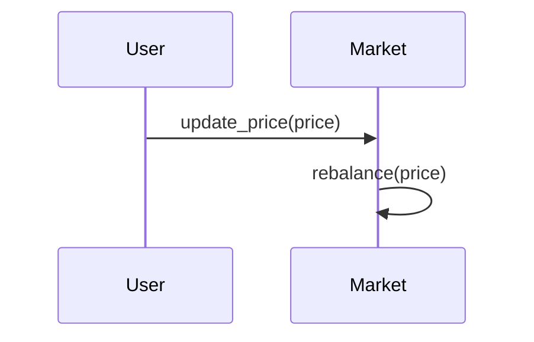

# Casper Sorts: Pool-based Perpetual Swap

    Maciej Zielinski

<b>Abstract.</b> 
The Casper Shorts is a variation of a perpetual swap contract that is fully
onchain. It uses a pool-based mechanism to manage the liquidity between long and
short positions in case of price changes. Its design is gas-efficient and allows
for a high number of transactions.

## 1. Introduction
Perpetual swap is a contract between two parties to bet on the price of an
asset. One party goes long and the other goes short. The core idea of the system
is that whenever the price of the underlying asset changes, the system
rebalances the liquidity between long and short positions. Deposits are 
represented $LONG$ and $SHORT$ tokens. System requires an oracle to provide the
price of the underlying asset.

## 2. Definitions

Smart contracts used to repesent the system:
- $csCSPR$ - Wrapped Casper CSPR token, used an underlying asset in the
  perpetual swap. Later referred aa _asset_.
- $LONG$ - Token that represents the long position,
- $SHORT$ - Token that represents the short position,
- $Market$ - Contract that manages deposits, withdrawals, price oracle and
  rebalancing of the liquidity between long and short positions.

The $State$ of the system is defined as:

$$ State = (P, L_{Long}, L_{Short}, T_{Long}, T_{Short}) $$

where:
- $P$ - the current price of the asset,
- $L_{Long}$ - the total amount of the asset for the long position,
- $L_{Short}$ - the total amount of the asset for the short position,
- $T_{Long}$ - the total supply for the $LONG$ token,
- $T_{Short}$ - the total supply for the $SHORT$ token.

In addition:

- $D$ - the _Deposit_ amount of $scCSPR$ added to the long or short position,
- $W$ - the _Withdrawal_ amount of $LONG$ or $SHORT$ removed from the position,
- $L$ - the _Liquidity_ amount of the long or short positions.
- $S$ - the total _Supply of the $LONG$ or $SHORT$ token.

## 3. Rebalce Mechanism

Whenever new price $P_{i+1}$ is received, the system updates the $State$, by
rebalancing the liquidity between long and short positions. If the new price is
lower then the previous price $P_i$, first the short position is reduced and
then the long position is increased with the same amount. And vice versa for the
price increase. 

The __Rebalancing Algorithm__ has two steps:
1. __Loss Phase__: System calculates the `loss` amount of underlying asset, that
the losing side lost. It is poportional the the price change. The maximum value
of it can be the total amount of the losing side. It is substracted from the
losing side.
2. __Gain Phase__: System adds the `loss` amount of the asset to the winning
side.

It is can be defined it for both sides separately.

### 3.1 Price Increased

Short position is losing liquidity and it is transferred to the long position.
The formula is intended to cap the adjustment to the total available liquidity,
using the `min` function.

$$ \Delta L_{Short}(i + 1) = L_{Short}(i) \times min(1, \frac{P(i+1)}{P(i)} - 1) $$
$$ L_{Short}(i+1) = L_{Short}(i) - \Delta L_{Short} $$
$$ L_{Long}(i+1) = L_{Long}(i) + \Delta L_{Short} $$

### 3.2 Price Decreased

Long position is losing liquidity and it is transferred to the short position.

$$ \Delta L_{Long}(i + 1) = L_{Long}(i) \times (1 - \frac{P(i)}{P(i+1)}) $$
$$ L_{Short}(i+1) = L_{Short}(i) + \Delta L_{Long} $$
$$ L_{Long}(i+1) = L_{Long}(i) - \Delta L_{Long} $$

## 4. Asset Deposit

When user deposits funds $D$ into the short or long position, the system
calculates the new amount of the position and the new total supply of the long
or short token.

$$ L(i+1) = L(i) + D $$
$$ \Delta T(i+1) = T(i) \times (\frac{L(i+1)}{L(i)} - 1) $$
$$ T(i+1) = T(i) + \Delta S $$

## 5. Asset Withdraw

When user withdraws $W$ of $LONG$ or $SHORT$ tokens, the system calculates the
new amount of the position and the new total supply of the token.

$$ T(i+1) = T(i) - W $$
$$ \Delta L(i+1) = L(i) \times (1 - \frac{T(i)}{T(i+1)}) $$
$$ L(i+1) = L(i) - \Delta L $$

## 6. System Implementation

### 6.1 Price Rebalance Sequence Diagram

## Appendix 1 - Examples

Example scenarios of the rebalance mechanism, deposit and withdrawal.

### Example 1: Price goes up by more then 100%

Given:

$P(i) = 0.01 \text{USD/CSPR}$

$P(i+1) = 0.03 \text{ USD/CSPR}$

$L_{Short}(i) = 100 \text { CSPR}$

$L_{Long}(i) = 200 \text { CSPR}$

Then:

$\Delta L_{Short}(i+1) = 100 \times min(1, \frac{0.03}{0.01} - 1) = 100 \times 1 = 100 \text{ CSPR}$ 

$L_{Short}(i+1) = 100 - 100 = 0 \text{ CSPR}$

$L_{Long}(i+1) = 200 + 100 = 300 \text{ CSPR}$

### Example 2: Price goes up by less then 100%

Given:

$P(i) = 0.01 \text{USD/CSPR}$

$P(i+1) = 0.014 \text{ USD/CSPR}$

$L_{Short}(i) = 100 \text { CSPR}$

$L_{Long}(i) = 200 \text { CSPR}$

Then:

$\Delta L_{Short}(i+1) = 100 \times min(1, \frac{0.014}{0.01} - 1) = 100 \times 0.4 = 40 \text { CSPR}$

$L_{Short}(i+1) = 100 - 40 = 60 \text { CSPR}$

$L_{Long}(i+1) = 200 + 40 = 240 \text { CSPR}$

### Example 3: Price goes down

Given:

$P(i) = 0.02 \text{USD/CSPR}$

$P(i+1) = 0.015 \text{ USD/CSPR}$

$L_{Short}(i) = 100 \text { CSPR}$

$L_{Long}(i) = 200 \text { CSPR}$

Then:

$\Delta L_{Long}(i+1) = 200 \times (1 - \frac{0.015}{0.02}) = 200 \times 0.25 = 50 \text{ CSPR}$ 

$L_{Short}(i+1) = 100 + 50 = 150 \text{ CSPR}$

$L_{Long}(i+1) = 200 - 50 = 150 \text{ CSPR}$

### Example 4: Liquidity deposit

Given:

$L(i) = 200 \text { CSPR}$

$D = 100 \text { CSPR}$

$T(i) = 1000 \text{ LONG}$

Then:

$L(i+1) = 200 + 100 = 300 \text{ CSPR}$

$\Delta T(i+1) = 1000 \times (\frac{300}{200} - 1) = 1000 \times 0.5 = 500 \text{ LONG}$

$T_{Long}(i+1) = 1000 + 500 = 1500 \text{ LONG}$

### Example 5: Liquidity withdraw

Given:

$L(i) = 400 \text { CSPR}$

$W = 100 \text { LONG}$

$T(i) = 1000 \text{ LONG}$

Then:

$T(i+1) = 1000 - 100 = 900 \text{ LONG}$

$\Delta L(i+1) = 400 \times (1 - \frac{900}{1000}) = 400 \times 0.1 = 40 \text{ CSPR}$

$L(i+1) = 400 - 40 = 360 \text{ CSPR}$

